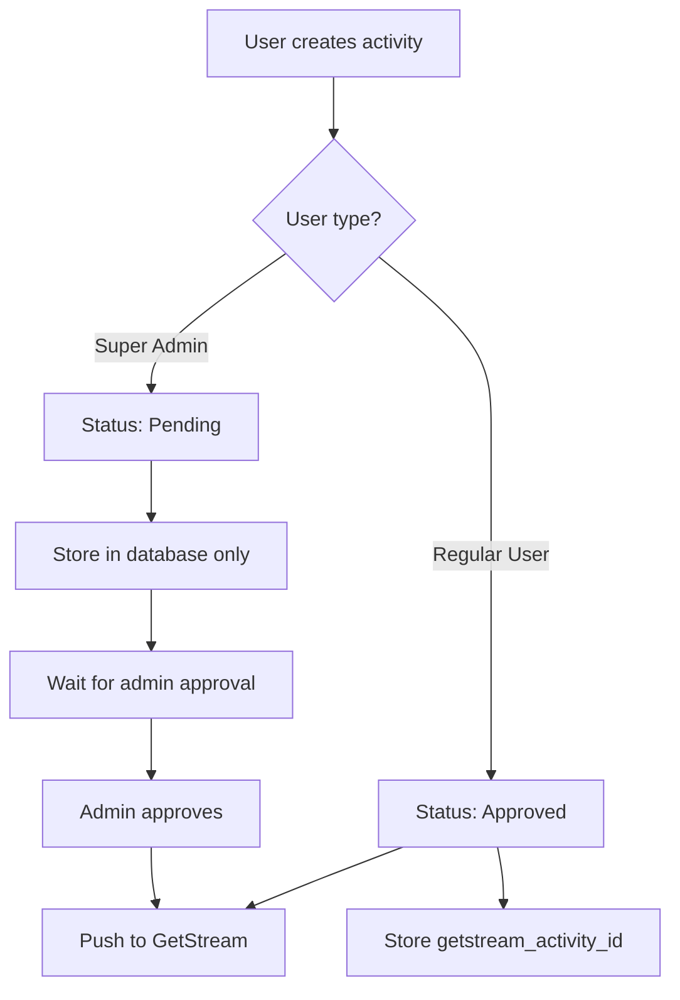
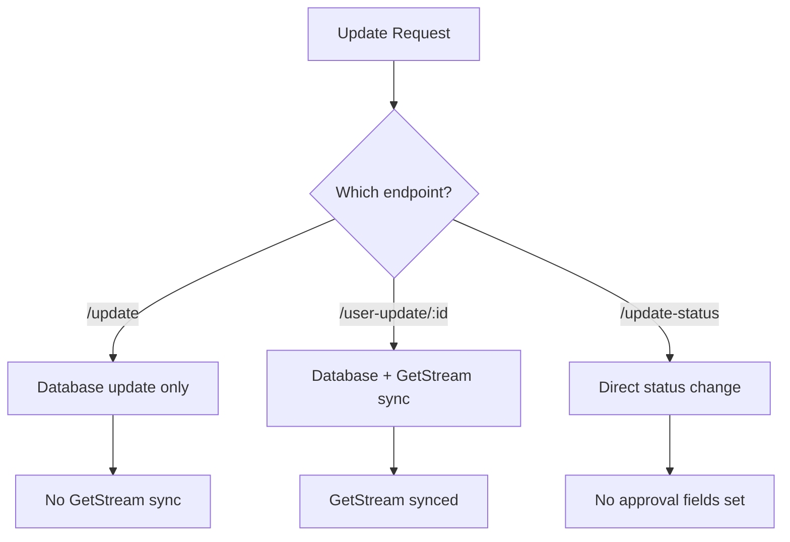

# News & Feed Management API Documentation

**Version:** 2.0.1 (Updated after Public Controller Separation)
**Base URL:** `http://localhost:3001/api`
**Authentication:** JWT Bearer Token (except public endpoints)
**Last Updated:** 2026-02-11

## 🎉 What's New in v2.0.1

### Latest Update: Public Controller Separation (Feb 11, 2026)

🔧 **Architecture Improvement**
- **Created `ActivitiesPublicController`** - Dedicated controller for public endpoints
- **Reason:** Public endpoints were returning 404 because they were under `@Controller('external')`
- **Fix:** Separated into `@Controller('public-feeds')` for correct routing
- **Result:**
  - ✅ `/api/public-feeds/activities` → Works (was 404)
  - ✅ `/api/public-feeds/activities/:id` → Works (was 404)
- **Files Added:**
  - `activities-public.controller.ts` - Public endpoints controller
  - `activities-postman-collection.json` - Complete Postman collection
- **Files Modified:**
  - `activities.module.ts` - Registered ActivitiesPublicController
  - `activities.controller.ts` - Removed public endpoints

### Major Changes (Phase 1-5 Implementation)

✅ **Phase 1: Added 5 Missing Endpoints**
- GET `/db-feeds/activities` - Admin dashboard with special logic
- POST `/db-feeds/activities/user-update/:id` - Update + GetStream sync
- POST `/db-feeds/activities/update-status` - Direct status update (admin only)
- GET `/public-feeds/activities` - Public list (NO authentication)
- GET `/public-feeds/activities/:id` - Public detail (NO authentication)

✅ **Phase 2: Fixed All Path Inconsistencies**
- All endpoints now use `/db-feeds/activities/*` prefix (except public)
- Changed HTTP methods: PUT→POST (update), DELETE→POST (delete)

✅ **Phase 3: Removed Duplicates**
- Removed duplicate approve endpoint
- Merged two delete endpoints into unified endpoint

✅ **Phase 4: Fixed Critical Business Logic**
- GET `/db-feeds/activities/post` now shows ONLY own activities for ALL users
- Previously super admins incorrectly saw all non-admin activities
- This endpoint is for "My Activities" page, not admin dashboard

✅ **Phase 5: New DTOs & Infrastructure**
- Created `UserUpdateActivityDto` and `UpdateStatusDto`
- Created `@Public()` decorator for unauthenticated endpoints
- Updated `AuthGuard` to support public endpoints
- Added 4 new repository methods

### Result
- **14 Total Endpoints** (was 10, now 14)
  - 11 Authenticated endpoints (ActivitiesController)
  - 2 Public endpoints (ActivitiesPublicController - NO auth)
  - 1 Legacy admin endpoint
- **2 Controllers:**
  - `ActivitiesController` → `/api/external/*` (authenticated)
  - `ActivitiesPublicController` → `/api/public-feeds/*` (public)
- All paths consistent with PHP DatabaseFeedController standard
- Build successful, TypeScript compilation clean
- Postman collection ready for import

---

## Table of Contents

- [Architecture](#architecture)
- [Postman Collection](#postman-collection)
- [Authentication](#authentication)
- [Quick Reference](#quick-reference)
- [Error Handling](#error-handling)
- [Data Models](#data-models)
- [API Endpoints](#api-endpoints)
  - [My Activities](#my-activities)
  - [Activity Management](#activity-management)
  - [Admin Dashboard](#admin-dashboard)
  - [Admin Approval Workflow](#admin-approval-workflow)
  - [Admin Direct Operations](#admin-direct-operations)
  - [Public Endpoints (No Auth)](#public-endpoints-no-auth)
- [Workflow](#workflow)
- [Integration with GetStream](#integration-with-getstream)

---

## Architecture

### Controller Structure

The Activities API is split into **2 separate controllers** for better organization and routing:

#### 1. **ActivitiesController** (`@Controller('external')`)
- **Base Path:** `/api/external/*`
- **Authentication:** Required (JWT Bearer Token)
- **Endpoints:** 11 authenticated endpoints
- **Purpose:** Main business logic for authenticated users
- **Guards:** `AuthGuard` (all endpoints), `AdminGuard` (admin-only endpoints)

**Endpoints:**
- ✅ GET `/db-feeds/activities/post` - My activities
- ✅ POST `/db-feeds/activities/create` - Create
- ✅ POST `/db-feeds/activities/update` - Update (DB only)
- ✅ POST `/db-feeds/activities/user-update/:id` - Update + sync
- ✅ GET `/db-feeds/activities/:id` - Detail
- ✅ POST `/db-feeds/activities/delete` - Delete
- ✅ GET `/db-feeds/activities` - Dashboard
- 🔒 POST `/db-feeds/activities/approve` - Approve (admin)
- 🔒 POST `/db-feeds/activities/reject` - Reject (admin)
- 🔒 POST `/db-feeds/activities/update-status` - Direct status (admin)
- 🔒 GET `/activities` - Feed management (admin, legacy)

#### 2. **ActivitiesPublicController** (`@Controller('public-feeds')`)
- **Base Path:** `/api/public-feeds/*`
- **Authentication:** None (Public access)
- **Endpoints:** 2 public endpoints
- **Purpose:** SEO-friendly, public-facing endpoints for approved content
- **Decorator:** `@Public()` on controller level (bypasses AuthGuard)

**Endpoints:**
- ⭕ GET `/activities` - Public list (approved only)
- ⭕ GET `/activities/:id` - Public detail (expanded)

### Why Separate Controllers?

**Before (v2.0.0):**
```typescript
@Controller('external')
export class ActivitiesController {
  // Problem: Public endpoints under 'external' prefix
  @Public()
  @Get('public-feeds/activities')  // ❌ /api/external/public-feeds/activities (WRONG!)
}
```

**After (v2.0.1):**
```typescript
// Authenticated Controller
@Controller('external')
@UseGuards(AuthGuard)
export class ActivitiesController {
  // All authenticated endpoints here
}

// Public Controller (NEW)
@Controller('public-feeds')
@Public()
export class ActivitiesPublicController {
  @Get('activities')  // ✅ /api/public-feeds/activities (CORRECT!)
}
```

**Benefits:**
- ✅ Correct routing for public endpoints
- ✅ Clear separation of concerns
- ✅ Easier to apply guards at controller level
- ✅ Better code organization and maintainability

---

## Postman Collection

### Import Instructions

A complete Postman Collection v2.1.0 is available at:
📄 **File:** `docs/activities-postman-collection.json`

**To Import:**
1. Open Postman
2. Click **Import** (top left)
3. Select file: `activities-postman-collection.json`
4. Click **Import**

**Setup Environment:**
1. Create new environment in Postman
2. Add variables:
   - `base_url` = `http://localhost:3000` (or your server URL)
   - `auth_token` = `your-jwt-token-here`
3. Select the environment

**What's Included:**
- ✅ All 14 endpoints organized in 6 folders
- ✅ Sample request data for all endpoints
- ✅ Query parameters with descriptions
- ✅ Authentication headers (Bearer Token)
- ✅ Public endpoints (no auth needed)
- ✅ File upload examples (multipart/form-data)
- ✅ Environment variables for easy switching

**Collection Structure:**
```
Activities API v2.0.1
├── My Activities (1 endpoint)
├── Activity Management (5 endpoints)
├── Admin Dashboard (1 endpoint)
├── Admin Approval Workflow (2 endpoints)
├── Admin Direct Operations (1 endpoint)
├── Public Endpoints (2 endpoints - NO AUTH)
└── Legacy Endpoints (1 endpoint)
```

---

## Authentication

### Required Headers (Authenticated Endpoints)
```http
Authorization: Bearer <your-jwt-token>
Content-Type: application/json
Content-Type: multipart/form-data  # For file uploads
```

### Public Endpoints (No Authentication Required)
```http
# NO Authorization header needed
GET /api/public-feeds/activities
GET /api/public-feeds/activities/:id
```

### User Types & Access Control

| Feature | Regular User | Super Admin | Notes |
|---------|-------------|-------------|-------|
| **Create Activity** | ✅ Auto-approved | ✅ Pending approval | Regular users push to GetStream immediately |
| **Update Activity** | ✅ Own only | ✅ Own only | Database only, no GetStream sync |
| **User-Update Activity** | ✅ Own only | ✅ Own only | Updates + syncs to GetStream |
| **Delete Activity** | ✅ Own only | ✅ Any activity | Admin can delete any |
| **Approve/Reject** | ❌ Forbidden | ✅ Admin only | Admin workflow actions |
| **Direct Status Update** | ❌ Forbidden | ✅ Admin only | Bypass workflow |
| **Dashboard** | Own activities | All non-admin | Different logic per user type |
| **Public Endpoints** | ✅ Anyone | ✅ Anyone | NO authentication needed |

---

## Quick Reference

### Full Endpoint List (14 Total)

| # | Category | Method | Path | Auth | Description |
|---|----------|--------|------|------|-------------|
| **MY ACTIVITIES** |
| 1 | My Activities | GET | `/db-feeds/activities/post` | ✅ | Own activities (all users) |
| **ACTIVITY MANAGEMENT** |
| 2 | Create | POST | `/db-feeds/activities/create` | ✅ | Create with auto-approval |
| 3 | Update | POST | `/db-feeds/activities/update` | ✅ | Update (DB only, no sync) |
| 4 | User-Update | POST | `/db-feeds/activities/user-update/:id` | ✅ | Update + sync GetStream |
| 5 | Detail | GET | `/db-feeds/activities/:id` | ✅ | Get detail by ID |
| 6 | Delete | POST | `/db-feeds/activities/delete` | ✅ | Delete (unified) |
| **ADMIN DASHBOARD** |
| 7 | Dashboard | GET | `/db-feeds/activities` | ✅ | Admin dashboard with logic |
| 11 | Feed Mgmt | GET | `/activities` | 🔒 Admin | All activities (legacy) |
| **ADMIN APPROVAL WORKFLOW** |
| 8 | Approve | POST | `/db-feeds/activities/approve` | 🔒 Admin | Approve pending |
| 9 | Reject | POST | `/db-feeds/activities/reject` | 🔒 Admin | Reject pending |
| **ADMIN DIRECT OPERATIONS** |
| 10 | Update Status | POST | `/db-feeds/activities/update-status` | 🔒 Admin | Direct status change |
| **PUBLIC (NO AUTH)** |
| 12 | Public List | GET | `/public-feeds/activities` | ⭕ Public | Approved activities only |
| 13 | Public Detail | GET | `/public-feeds/activities/:id` | ⭕ Public | Expanded detail |
| **UTILITY** |
| 14 | Count | GET | `/db-feeds/activities/count` | ✅ | Total count |

**Legend:**
- ✅ = Authenticated (regular users + admins)
- 🔒 = Admin only (requires AdminGuard)
- ⭕ = Public (NO authentication)

---

## Error Handling

### Standard Error Response
```json
{
  "status": false,
  "message": "Error message in Vietnamese",
  "data": null,
  "errors": []
}
```

### Common Error Codes

| Status Code | Description |
|-------------|-------------|
| 400 | Bad Request - Validation errors |
| 401 | Unauthorized - Missing/invalid JWT |
| 403 | Forbidden - Admin access required |
| 404 | Not Found - Resource doesn't exist |
| 500 | Internal Server Error |

---

## Data Models

### UserActivity Entity

```typescript
{
  id: number,
  user_id: number,
  title?: string,                    // Vietnamese (optional)
  content: string,                   // Vietnamese (required)
  industries?: IndustryItem[],       // [{ id, name }]
  services?: ServiceItem[],          // [{ id, name }]
  file_uri?: string,
  activity_data?: ActivityDataStructure,
  status: ActivityStatus,            // Pending | Approved | Rejected
  notes?: string,
  source: ActivitySource,            // admin_created | ai_auto_generated
  approved_by?: number,
  approved_at?: Date,
  rejected_by?: number,
  rejected_at?: Date,
  getstream_activity_id?: string,
  created_at: Date,
  updated_at: Date
}
```

### Activity Status Flow

```
Regular User:  Create → Approved → GetStream
Super Admin:   Create → Pending → [Approve → Approved → GetStream]
                                 [Reject → Rejected]
```

---

## API Endpoints

## My Activities

### 1. GET /db-feeds/activities/post
**Get Own Activities (All Users)**

**🔧 FIXED in Phase 4:** Now shows ONLY own activities for ALL users (including super admins)

**Endpoint:** `GET /api/external/db-feeds/activities/post`

**Authentication:** ✅ Required

**Business Logic:**
- **Everyone** (regular users + super admins) sees ONLY their own activities
- This is for "My Activities" page
- For admin dashboard, use endpoint #7 instead

**Query Parameters:**
```typescript
{
  page?: number,      // Default: 1
  limit?: number,     // Default: 10
  status?: string,    // "Pending,Approved,Rejected" (comma-separated)
  source?: string     // "admin_created" | "ai_auto_generated"
}
```

**Request Example:**
```http
GET /api/external/db-feeds/activities/post?page=1&limit=10&status=Approved
Authorization: Bearer <token>
```

**Success Response (200):**
```json
{
  "status": true,
  "message": "Lấy danh sách hoạt động thành công",
  "data": {
    "current_page": 1,
    "data": [...],
    "last_page": 5,
    "total": 42,
    "per_page": 10
  }
}
```

**PHP Reference:** `DatabaseFeedController@getAdminActivities` (line 875-924)

---

## Activity Management

### 2. POST /db-feeds/activities/create
**Create New Activity**

**Endpoint:** `POST /api/external/db-feeds/activities/create`

**Authentication:** ✅ Required

**Content-Type:** `multipart/form-data`

**Request Body:**
```typescript
{
  title?: string,           // Vietnamese title
  content: string,          // Vietnamese content (required)
  title_en?: string,        // English title
  content_en?: string,      // English content
  industries?: number[],    // Industry IDs (backend looks up names)
  services?: number[],      // Service IDs (backend looks up names)
  file?: File,              // Image/document upload
  notes?: string,           // Internal notes
  source?: string           // Default: "admin_created"
}
```

**Auto-Approval Logic:**
```typescript
if (user.type === 'super admin') {
  status = 'Pending';           // Requires approval
  getstream_activity_id = null; // Not synced yet
} else {
  status = 'Approved';          // Auto-approved
  getstream_activity_id = '...';// Immediately synced
}
```

**Request Example (JavaScript):**
```javascript
const formData = new FormData();
formData.append('title', 'Tiêu đề');
formData.append('content', 'Nội dung');
formData.append('industries', JSON.stringify([1, 3]));
formData.append('file', fileInput.files[0]);

await fetch('/api/external/db-feeds/activities/create', {
  method: 'POST',
  headers: { 'Authorization': `Bearer ${token}` },
  body: formData
});
```

**PHP Reference:** `DatabaseFeedController@createActivity` (line 28-206)

---

### 3. POST /db-feeds/activities/update
**Update Activity (Database Only)**

**⚠️ Changed from PUT to POST in Phase 2**

**Endpoint:** `POST /api/external/db-feeds/activities/update`

**Authentication:** ✅ Required (owner only)

**Content-Type:** `multipart/form-data`

**Business Logic:**
- Updates database ONLY
- Does NOT sync to GetStream
- User can only update own activities

**Request Body:**
```typescript
{
  activity_id: number,      // Required
  title?: string,
  content?: string,
  title_en?: string,
  content_en?: string,
  industries?: number[],
  services?: number[],
  file?: File
}
```

**PHP Reference:** `DatabaseFeedController@updateActivity` (line 211-368)

---

### 4. POST /db-feeds/activities/user-update/:getstream_activity_id
**Update Activity + Sync to GetStream**

**✨ NEW in Phase 1.2**

**Endpoint:** `POST /api/external/db-feeds/activities/user-update/:getstream_activity_id`

**Authentication:** ✅ Required (owner only)

**Content-Type:** `multipart/form-data`

**Path Parameters:**
- `getstream_activity_id` (string) - GetStream activity ID (NOT database ID)

**Business Logic:**
- Finds activity by GetStream ID (not database ID)
- Updates database
- Syncs to GetStream immediately
- Critical for real-time feed updates

**Request Body:**
```typescript
{
  content: string,          // Required
  title?: string,
  content_en?: string,
  title_en?: string,
  industries?: number[],
  services?: number[],
  file?: File,
  notes?: string
}
```

**Request Example:**
```bash
curl -X POST http://localhost:3001/api/external/db-feeds/activities/user-update/54a60c1e-4ee3-11e4-8689-1234567890ab \
  -H "Authorization: Bearer <token>" \
  -F "content=Updated content" \
  -F "industries=[1,3]"
```

**Success Response (200):**
```json
{
  "status": true,
  "message": "Cập nhật và đồng bộ hoạt động thành công",
  "data": {
    "id": 124,
    "getstream_activity_id": "54a60c1e-4ee3-11e4-8689-1234567890ab",
    "updated_at": "2026-02-11T12:00:00.000Z"
  }
}
```

**PHP Reference:** `DatabaseFeedController@userUpdateActivity` (line 371-557)

---

### 5. GET /db-feeds/activities/:id
**Get Activity Detail**

**Endpoint:** `GET /api/external/db-feeds/activities/:id`

**Authentication:** ✅ Required

**Path Parameters:**
- `id` (number) - Activity database ID

**Request Example:**
```http
GET /api/external/db-feeds/activities/124
Authorization: Bearer <token>
```

**PHP Reference:** `DatabaseFeedController@getActivityDetail`

---

### 6. POST /db-feeds/activities/delete
**Delete Activity (Unified Endpoint)**

**⚠️ Changed from DELETE to POST in Phase 2**
**✨ Merged duplicate endpoints in Phase 3**

**Endpoint:** `POST /api/external/db-feeds/activities/delete`

**Authentication:** ✅ Required

**Business Logic:**
- **Regular users:** Can delete own activities only
- **Super admins:** Can delete ANY activity
- Deletes from: Database + GetStream + File storage

**Request Body:**
```json
{
  "activity_id": 124
}
```

**Success Response (200):**
```json
{
  "status": true,
  "message": "Xóa hoạt động thành công",
  "data": {
    "message": "Activity deleted successfully"
  }
}
```

**PHP Reference:** `DatabaseFeedController@deleteActivity` (line 562-640)

---

## Admin Dashboard

### 7. GET /db-feeds/activities
**Dashboard Activities with Admin Logic**

**✨ NEW in Phase 1.1**

**Endpoint:** `GET /api/external/db-feeds/activities`

**Authentication:** ✅ Required

**Business Logic:**
- **Regular users:** See ONLY own activities
- **Super admins:** See ALL non-admin activities (excludes other super admins)
- Different from endpoint #1 (which shows only own for everyone)

**Query Parameters:**
```typescript
{
  page?: number,
  limit?: number,
  status?: string,    // "Pending,Approved,Rejected"
  source?: string
}
```

**Request Example:**
```http
GET /api/external/db-feeds/activities?page=1&limit=10
Authorization: Bearer <admin-token>
```

**Success Response (200):**
```json
{
  "status": true,
  "message": "Lấy danh sách hoạt động thành công",
  "data": {
    "current_page": 1,
    "data": [...],      // All non-admin activities for admin
    "per_page": 10,
    "total": 150
  }
}
```

**PHP Reference:** `DatabaseFeedController@getActivities` (line 645-702)

---

### 11. GET /activities
**Feed Management Dashboard (Legacy)**

**Endpoint:** `GET /api/external/activities`

**Authentication:** 🔒 Admin only

**Guards:** `AuthGuard`, `AdminGuard`

**Business Logic:**
- Returns ALL activities (no pagination)
- For feed management interface
- Legacy endpoint kept for backward compatibility

**PHP Reference:** `DatabaseFeedController@getAllActivitiesForFeedManagement` (line 893)

---

## Admin Approval Workflow

### 8. POST /db-feeds/activities/approve
**Approve Pending Activity**

**Endpoint:** `POST /api/external/db-feeds/activities/approve`

**Authentication:** 🔒 Admin only

**Guards:** `AuthGuard`, `AdminGuard`

**Request Body:**
```json
{
  "activity_id": 125
}
```

**Business Logic:**
1. Changes status to "Approved"
2. Creates activity in GetStream
3. Sets `approved_by` and `approved_at`
4. Stores GetStream activity ID
5. **🔔 Dispatches FCM notification** (background job) - See [FCM Notification System](./FCM_NOTIFICATION_SYSTEM.md)

**Success Response (200):**
```json
{
  "status": true,
  "message": "Phê duyệt hoạt động thành công",
  "data": {
    "id": 125,
    "status": "Approved",
    "approved_by": 13,
    "approved_at": "2026-02-11T11:15:00.000Z",
    "getstream_activity_id": "78b90d2f-5ab4-12e5-9123-abcdef123456"
  }
}
```

**PHP Reference:** `DatabaseFeedController@approveActivity` (line 744-825)

---

### 9. POST /db-feeds/activities/reject
**Reject Pending Activity**

**Endpoint:** `POST /api/external/db-feeds/activities/reject`

**Authentication:** 🔒 Admin only

**Guards:** `AuthGuard`, `AdminGuard`

**Request Body:**
```json
{
  "activity_id": 123,
  "reason": "Nội dung không phù hợp"
}
```

**Business Logic:**
1. Changes status to "Rejected"
2. Sets `rejected_by` and `rejected_at`
3. Saves rejection reason in `notes`
4. Does NOT sync to GetStream

**Success Response (200):**
```json
{
  "status": true,
  "message": "Từ chối hoạt động thành công",
  "data": {
    "id": 123,
    "status": "Rejected",
    "rejected_by": 13,
    "rejected_at": "2026-02-11T11:45:00.000Z",
    "notes": "Nội dung không phù hợp"
  }
}
```

**PHP Reference:** `DatabaseFeedController@rejectActivity` (line 827-872)

---

## Admin Direct Operations

### 10. POST /db-feeds/activities/update-status
**Direct Status Update (No Workflow)**

**✨ NEW in Phase 1.3**

**Endpoint:** `POST /api/external/db-feeds/activities/update-status`

**Authentication:** 🔒 Admin only

**Guards:** `AuthGuard`, `AdminGuard`

**Request Body:**
```json
{
  "activity_id": 123,
  "status": "Approved",
  "notes": "Direct approval for testing"
}
```

**Business Logic:**
- Updates status directly
- Does NOT set `approved_by` or `rejected_by` fields
- Does NOT sync to GetStream
- Use for manual corrections or testing

**⚠️ Difference from approve/reject:**
- **approve/reject:** Full workflow, sets approval fields, syncs GetStream
- **update-status:** Direct change, no workflow, no GetStream sync

**Success Response (200):**
```json
{
  "status": true,
  "message": "Cập nhật trạng thái hoạt động thành công",
  "data": {
    "id": 123,
    "status": "Approved",
    "updated_at": "2026-02-11T12:30:00.000Z"
  }
}
```

**PHP Reference:** `DatabaseFeedController@updateActivityStatus` (line 725-803)

---

## Public Endpoints (No Auth)

### 12. GET /public-feeds/activities
**Public Activity List**

**✨ NEW in Phase 1.4**

**Endpoint:** `GET /api/public-feeds/activities`

**Authentication:** ⭕ NO authentication required

**Decorator:** `@Public()`

**Business Logic:**
- Returns ONLY approved activities
- No authentication needed
- For SEO, social sharing, mobile apps without login

**Query Parameters:**
```typescript
{
  page?: number,
  limit?: number,
  user_id?: number    // Filter by specific user
}
```

**Request Example:**
```http
GET /api/public-feeds/activities?page=1&limit=5&user_id=5
# NO Authorization header needed
```

**Success Response (200):**
```json
{
  "status": true,
  "message": "Lấy danh sách hoạt động công khai thành công",
  "data": {
    "current_page": 1,
    "data": [
      {
        "id": 124,
        "title": "Public Activity",
        "content": "...",
        "status": "Approved",
        "user": {...}
      }
    ],
    "per_page": 5,
    "total": 20
  }
}
```

**PHP Reference:** `DatabaseFeedController@getPublicActivities` (line 929-964)

---

### 13. GET /public-feeds/activities/:id
**Public Activity Detail**

**✨ NEW in Phase 1.5**

**Endpoint:** `GET /api/public-feeds/activities/:id`

**Authentication:** ⭕ NO authentication required

**Decorator:** `@Public()`

**Path Parameters:**
- `id` (number) - Activity ID

**Business Logic:**
- Returns ONLY approved activity
- Expands `industry_details` and `service_details` (full objects, not just IDs)
- No authentication needed

**Request Example:**
```http
GET /api/public-feeds/activities/124
# NO Authorization header needed
```

**Success Response (200):**
```json
{
  "status": true,
  "message": "Lấy thông tin hoạt động công khai thành công",
  "data": {
    "id": 124,
    "title": "Public Activity",
    "content": "...",
    "status": "Approved",
    "industries": [{ "id": 1, "name": "Công nghệ" }],
    "services": [{ "id": 5, "name": "Tư vấn" }],
    "industry_details": [
      {
        "id": 1,
        "name": "Công nghệ",
        "status": 1,
        "language": "vi",
        "created_at": "..."
      }
    ],
    "service_details": [
      {
        "id": 5,
        "name": "Tư vấn",
        "status": 1,
        "language": "vi",
        "type": "service",
        "created_at": "..."
      }
    ],
    "user": {...}
  }
}
```

**Error Response (404) - Not approved or not found:**
```json
{
  "status": false,
  "message": "Activity not found or not publicly available",
  "data": null,
  "errors": []
}
```

**PHP Reference:** `DatabaseFeedController@getPublicActivityDetail` (line 969-999)

---

## Workflow

### User Activity Creation Flow



### Update Workflows



### GetStream Synchronization Points

| Action | Endpoint | GetStream Sync? | Notes |
|--------|----------|-----------------|-------|
| Create (regular user) | `/create` | ✅ Yes | Immediate sync on auto-approval |
| Create (super admin) | `/create` | ❌ No | Pending status, not synced |
| Update | `/update` | ❌ No | Database only |
| User-Update | `/user-update/:id` | ✅ Yes | Updates + syncs |
| Approve | `/approve` | ✅ Yes | Creates in GetStream |
| Reject | `/reject` | ❌ No | Never synced |
| Update Status | `/update-status` | ❌ No | Direct change, no sync |
| Delete | `/delete` | ✅ Yes (if exists) | Removes from GetStream |

---

## Integration with GetStream

### Activity Structure

```json
{
  "actor": "user_5",
  "verb": "post",
  "object": "post:1739258374123",
  "foreign_id": "user_activity_124",
  "time": "2026-02-11T10:30:00.000Z",
  "data": {
    "title": "Chào mừng",
    "content": "Nội dung...",
    "industries": [{ "id": 1, "name": "Công nghệ" }],
    "services": [{ "id": 5, "name": "Tư vấn" }],
    "file_uri": "/uploads/activities/..."
  },
  "extra": {
    "language": {
      "en": {
        "title": "Welcome",
        "content": "Content...",
        "industries": [{ "id": 1, "name": "Technology" }],
        "services": [{ "id": 5, "name": "Consulting" }]
      }
    }
  }
}
```

### GetStream Operations

| Operation | Method | When |
|-----------|--------|------|
| Create | `feed.addActivity()` | On approve (pending) or create (regular user) |
| Update | `updateActivityOnGetStream()` | On `/user-update/:id` endpoint |
| Delete | `feed.removeActivity()` | On delete (if activity exists in GetStream) |

---

## Path Changes Summary

### Before (v1.0.0) vs After (v2.0.0)

| Old Path | New Path | Method Change |
|----------|----------|---------------|
| `user/db-feeds/activities/post` | `db-feeds/activities/post` | - |
| `posts/create` | `db-feeds/activities/create` | - |
| `posts/update` | `db-feeds/activities/update` | PUT→POST |
| `posts/:id` | `db-feeds/activities/:id` | - |
| `posts/delete` | `db-feeds/activities/delete` | DELETE→POST |
| `posts/approve` | `db-feeds/activities/approve` | - |
| `activities/approve` | `db-feeds/activities/approve` | (merged) |
| `activities/reject` | `db-feeds/activities/reject` | - |
| `activities/delete` | `db-feeds/activities/delete` | (merged) |

### New Endpoints (Not in v1.0.0)

- `POST /db-feeds/activities/user-update/:getstream_activity_id`
- `POST /db-feeds/activities/update-status`
- `GET /db-feeds/activities` (admin dashboard)
- `GET /public-feeds/activities` (public list)
- `GET /public-feeds/activities/:id` (public detail)

---

## Migration Guide from v1.0.0

### Frontend Changes Required

1. **Update all endpoint paths** to use `/db-feeds/activities/*` prefix
2. **Change HTTP methods:**
   - Update: `PUT` → `POST`
   - Delete: `DELETE` → `POST`
3. **Remove duplicate endpoint calls:**
   - Only use `/db-feeds/activities/approve` (remove `/posts/approve`)
   - Only use `/db-feeds/activities/delete` (remove `/activities/delete`)
4. **Update business logic assumptions:**
   - GET `/db-feeds/activities/post` now returns own activities for ALL users
   - Use GET `/db-feeds/activities` for admin dashboard instead

### Backend Compatibility

- Old paths will NOT work (breaking change)
- All 10 original endpoints have been updated
- 5 new endpoints added
- Total: 14 endpoints

---

## Related Documentation

- [API Endpoints JSON](./activities-endpoints.json) - Complete endpoint specification
- [API Comparison & Issues](./API_COMPARISON_AND_ISSUES.md) - Issues resolved in v2.0.0
- [Database Feed Controller Endpoints](./DATABASE_FEED_CONTROLLER_ENDPOINTS.md) - PHP reference
- **[FCM Notification System](./FCM_NOTIFICATION_SYSTEM.md)** - Push notification system for activity approvals

---

**Last Updated:** 2026-02-11
**API Version:** 2.0.0
**Documentation Version:** 2.0.0
**Implementation:** Phase 1-5 Complete ✅
